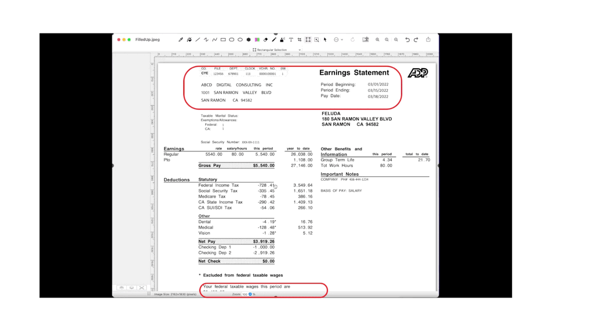

# Reading texts from the pre-filled scanned forms or live-scanner individual frames.

## About this package

This computer-vision package will invoke the python script that will instantiate the class to initiate the reading capability & display text from a pre-filled scanned forms or live scanner-based individual frames. This application developed using Open-CV. This project is for the advanced Python developer & Data Science Newbi's.


## How to use this package

(The following instructions apply to Posix/bash. Windows users should check
[here](https://docs.python.org/3/library/venv.html).)

First, clone this repository and open a terminal inside the root folder.

Create and activate a new virtual environment (recommended) by running
the following:

```bash
python3 -m venv venv
source venv/bin/activate
```

Install the requirements:

```bash
pip install -r requirements.txt
```

Run the Augmented Reality-App:

```bash
python readingFormLib.py
```
We need to understand that the current class has some basic limitations. We need to define the areas in terms of pixel position, which we need to extract.

We need to fill-up the zone in the following way -

```
'MY_DICT': {
          "atrib_1": {"id": "FileNo", "bbox": (425, 60, 92, 34), "filter_keywords": tuple(["FILE", "DEPT"])},
          "atrib_2": {"id": "DeptNo", "bbox": (545, 60, 87, 40), "filter_keywords": tuple(["DEPT", "CLOCK"])},
          "atrib_3": {"id": "ClockNo", "bbox": (673, 60, 75, 36), "filter_keywords": tuple(["CLOCK","VCHR.","NO."])},
          "atrib_4": {"id": "VCHRNo", "bbox": (785, 60, 136, 40), "filter_keywords": tuple(["VCHR.","NO."])},
          "atrib_5": {"id": "DigitNo", "bbox": (949, 60, 50, 38), "filter_keywords": tuple(["VCHR.","NO.", "056"])},
          "atrib_6": {"id": "CompanyName", "bbox": (326, 140, 621, 187), "filter_keywords": tuple(["COMPANY","FILE"])},
          "atrib_7": {"id": "StartDate", "bbox": (1264, 143, 539, 44), "filter_keywords": tuple(["Period", "Beginning:"])},
          "atrib_8": {"id": "EndDate", "bbox": (1264, 193, 539, 44), "filter_keywords": tuple(["Period", "Ending:"])},
          "atrib_9": {"id": "PayDate", "bbox": (1264, 233, 539, 44), "filter_keywords": tuple(["Pay", "Date:"])},
    }
```

To understand, how we've captured where to extract the texts are shown below -



Make sure that you are properly connected with a functional WebCam or scanned images (Preferably a separate external WebCAM).

## Screenshots


## Resources

- To learn more about Open-CV, check out our [documentation](https://opencv.org/opencv-free-course/).
- To learn more about ReadingFilledForm package, check out our [documentation](https://pypi.org/project/ReadingFilledForm/0.0.7/#description).
- To view the complete demo with sound, check out our [YouTube Page](https://youtu.be/5h53TB7RUMs).
